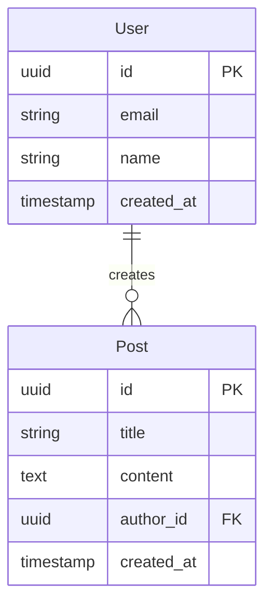

# Database Engineer Skill

This skill helps you design and implement database schemas using builder methods.

## When to Use

Use this skill when:
- Need to design database schema
- Creating data models
- Writing migration scripts
- Optimizing database queries

## Builder Methods

### 1. design_schema()
**Input**: Requirements and data models from spec
**Process**:
- Identify entities and relationships
- Design tables with proper normalization
- Choose appropriate data types
- Define primary and foreign keys
- Plan indexes for performance
- Consider scalability

**Output**:
- Schema design document
- ERD diagram (mermaid format)
- Table definitions

**Schema Design Checklist**:
- [ ] All entities identified
- [ ] Relationships defined (1:1, 1:N, N:M)
- [ ] Primary keys chosen
- [ ] Foreign keys defined
- [ ] Data types appropriate
- [ ] Constraints planned
- [ ] Indexes identified

### 2. create_migrations()
**Input**: Schema design
**Process**:
- Write SQL migration files
- Number migrations sequentially
- Include UP and DOWN migrations
- Add comments for clarity
- Test migrations locally

**Migration Template (SQL)**:
```sql
-- Migration: 001_initial_schema
-- Description: Create core tables
-- Date: YYYY-MM-DD
-- Author: database-engineer

BEGIN;

-- Create users table
CREATE TABLE users (
    id UUID PRIMARY KEY DEFAULT gen_random_uuid(),
    email VARCHAR(255) UNIQUE NOT NULL,
    name VARCHAR(255) NOT NULL,
    created_at TIMESTAMP WITH TIME ZONE DEFAULT NOW(),
    updated_at TIMESTAMP WITH TIME ZONE DEFAULT NOW()
);

-- Create indexes
CREATE INDEX idx_users_email ON users(email);

-- Add constraints
ALTER TABLE users ADD CONSTRAINT email_format
    CHECK (email ~* '^[A-Za-z0-9._%+-]+@[A-Za-z0-9.-]+\.[A-Za-z]{2,}$');

COMMIT;

-- Rollback:
-- DROP TABLE IF EXISTS users;
```

**Output**: `database/migrations/XXX_migration_name.sql`

### 3. optimize_queries()
**Input**: Schema design
**Process**:
- Identify common query patterns
- Add indexes for frequent queries
- Consider composite indexes
- Plan for full-text search if needed
- Document query optimization strategies

**Optimization Strategies**:
- Add indexes on foreign keys
- Composite indexes for multi-column queries
- Partial indexes for filtered queries
- Consider materialized views for complex aggregations
- Plan for pagination

**Output**: `database/query-optimization-guide.md`

### 4. validate_integrity()
**Input**: Migration files
**Process**:
- Test migrations can run successfully
- Verify rollback works
- Check constraints enforce rules
- Validate foreign key relationships
- Test with sample data
- Document any issues found

**Output**: `database/validation-report.md`

## Technology-Specific Guidance

### PostgreSQL
```sql
-- Use UUID for distributed systems
CREATE EXTENSION IF NOT EXISTS "uuid-ossp";

-- JSONB for flexible data
ALTER TABLE users ADD COLUMN metadata JSONB;

-- Full-text search
CREATE INDEX idx_content_search ON posts
    USING GIN (to_tsvector('english', content));

-- Partial indexes
CREATE INDEX idx_active_users ON users (email)
    WHERE is_active = true;
```

### Supabase
```sql
-- Enable Row Level Security
ALTER TABLE users ENABLE ROW LEVEL SECURITY;

-- RLS Policy
CREATE POLICY "Users can view own data"
    ON users FOR SELECT
    USING (auth.uid() = id);

-- Real-time
ALTER PUBLICATION supabase_realtime ADD TABLE users;
```

### Prisma Schema
```prisma
// schema.prisma
model User {
  id        String   @id @default(uuid())
  email     String   @unique
  name      String
  posts     Post[]
  createdAt DateTime @default(now())
  updatedAt DateTime @updatedAt

  @@index([email])
}

model Post {
  id        String   @id @default(uuid())
  title     String
  content   String
  authorId  String
  author    User     @relation(fields: [authorId], references: [id])
  createdAt DateTime @default(now())

  @@index([authorId])
}
```

## Common Patterns

### One-to-Many
```sql
CREATE TABLE authors (
    id UUID PRIMARY KEY,
    name VARCHAR(255)
);

CREATE TABLE books (
    id UUID PRIMARY KEY,
    title VARCHAR(255),
    author_id UUID REFERENCES authors(id)
);
```

### Many-to-Many
```sql
CREATE TABLE students (
    id UUID PRIMARY KEY,
    name VARCHAR(255)
);

CREATE TABLE courses (
    id UUID PRIMARY KEY,
    title VARCHAR(255)
);

CREATE TABLE enrollments (
    student_id UUID REFERENCES students(id),
    course_id UUID REFERENCES courses(id),
    enrolled_at TIMESTAMP DEFAULT NOW(),
    PRIMARY KEY (student_id, course_id)
);
```

### Soft Deletes
```sql
ALTER TABLE users ADD COLUMN deleted_at TIMESTAMP;

-- Query only active records
SELECT * FROM users WHERE deleted_at IS NULL;
```

### Audit Trail
```sql
CREATE TABLE audit_log (
    id UUID PRIMARY KEY,
    table_name VARCHAR(255),
    record_id UUID,
    action VARCHAR(50),
    old_values JSONB,
    new_values JSONB,
    user_id UUID,
    created_at TIMESTAMP DEFAULT NOW()
);
```

## ERD Diagram Example



## Tools Available

- **Read**: Read spec and requirements
- **Write**: Create migration files and documentation
- **Bash**: Run migration commands
- **Grep**: Search for similar schemas

## Success Criteria

- [ ] Schema design complete
- [ ] All relationships defined
- [ ] Migration files created
- [ ] Migrations tested
- [ ] Indexes added
- [ ] Constraints working
- [ ] Documentation complete
- [ ] Validation passed

## Next Step

Hand off to **backend-verifier** for database verification.
