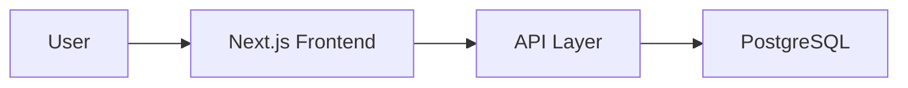

# Spec Writer Skill

Write comprehensive, detailed technical specifications.

## Builder Methods

### 1. draft_specification()
Create complete `spec.md` with:

```markdown
# {Project Name} Specification

## 1. Mission
What we're building and why

## 2. Requirements
### Functional
- Feature 1
- Feature 2

### Non-Functional
- Performance: <200ms API response
- Scalability: Support 10k users
- Security: JWT authentication, HTTPS

## 3. Architecture
### System Components
- Frontend: Next.js
- Backend: Node.js API
- Database: PostgreSQL
- Auth: JWT

### Architecture Diagram
[Mermaid diagram]

## 4. Data Models
User {
  id: UUID
  email: string
  name: string
}

## 5. API Endpoints
POST /api/users
GET /api/users/:id
...

## 6. UI/UX Design
- Component hierarchy
- User flows
- Design system

## 7. Testing Strategy
- Unit tests (70%)
- Integration tests (20%)
- E2E tests (10%)

## 8. Deployment
- Platform: Vercel
- Database: Supabase
- CI/CD: GitHub Actions
```

### 2. define_interfaces()
**Output**: `api-specification.md`

```markdown
## POST /api/users

### Request
```json
{
  "email": "user@example.com",
  "name": "John Doe"
}
```

### Response (201)
```json
{
  "success": true,
  "data": {
    "id": "uuid",
    "email": "user@example.com"
  }
}
```

### Errors
- 400: Validation error
- 409: Email exists
```

### 3. specify_contracts()
Define integration points and data contracts

**Output**: `integration-specifications.md`

### 4. create_diagrams()
Add mermaid diagrams throughout the spec



## Success Criteria
- [ ] Complete spec written
- [ ] All sections covered
- [ ] Clear and specific
- [ ] Diagrams included
- [ ] Ready for verification
