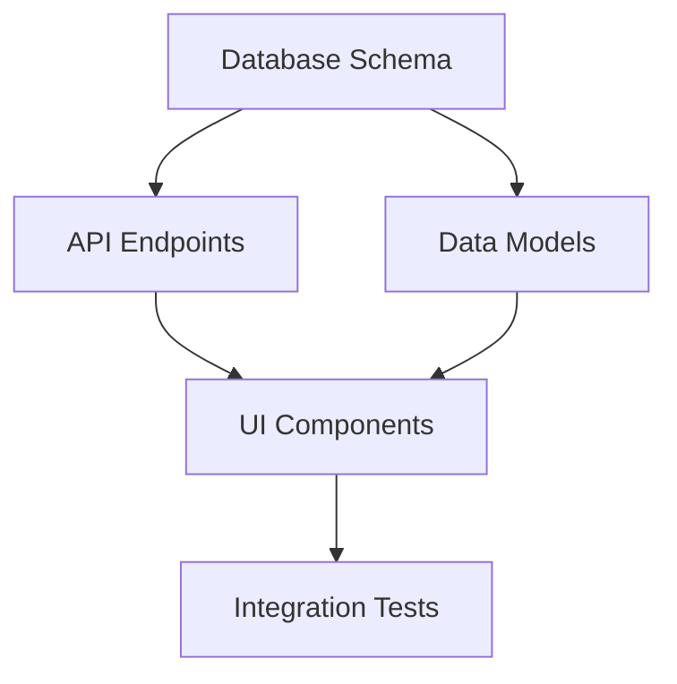

# Tasks List Creator Skill

Break down product plan into detailed, actionable task groups.

## Builder Methods

### 1. analyze_specification()
- Review complete spec and roadmap
- Understand technical architecture
- Identify all components
- Map integration points

### 2. identify_dependencies()
- Map technical dependencies
- Create dependency graph
- Identify blockers
- Find parallel work opportunities

**Dependency Graph Example**:


### 3. create_task_groups()
**Task Group Template**:
```markdown
## Task Group 1: Database Schema Design

**Agent**: database-engineer
**Dependencies**: None
**Priority**: High
**Estimated Complexity**: Medium

### Objective
Create complete database schema for the application

### Tasks
- [ ] Design user table schema
- [ ] Create posts table with relationships
- [ ] Add indexes for performance
- [ ] Write migration scripts
- [ ] Test migrations

### Deliverables
- `database/migrations/001_initial_schema.sql`
- `database/schema-diagram.md`

### Verification Criteria
- [ ] All tables created
- [ ] Relationships working
- [ ] Migrations reversible
- [ ] Sample data loads successfully
```

### 4. assign_priorities()
- Order tasks by dependencies
- Mark critical path items
- Balance workload
- Set realistic timelines

**Output**: `implementation/tasks.md`

## Example Task Breakdown

```markdown
# Implementation Tasks

## Task Group 1: Database Foundation
**Agent**: database-engineer
**Status**: Pending
- Design schema
- Create migrations
- Add indexes

## Task Group 2: API Layer
**Agent**: api-engineer
**Dependencies**: Task Group 1
**Status**: Pending
- Create endpoints
- Add validation
- Write tests

## Task Group 3: Frontend
**Agent**: ui-designer
**Dependencies**: Task Group 2
**Status**: Pending
- Build components
- Add interactions
- Ensure accessibility
```

## Success Criteria
- [ ] All features covered
- [ ] Dependencies mapped
- [ ] Tasks are atomic
- [ ] Verification criteria defined
- [ ] Agents assigned
