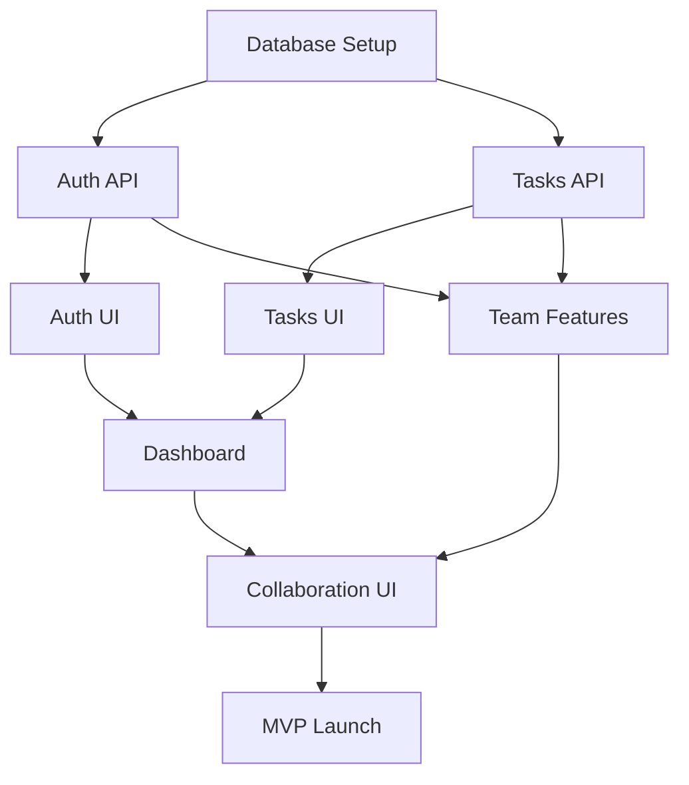

# TaskFlow - Product Roadmap

## Vision

Build a simple, intuitive task management SaaS for small teams that eliminates scattered work across multiple tools.

## Timeline Overview

```
Week 1-2    Week 3-4    Week 5-6    Week 7-8    Week 9-10   Week 11+
   |           |           |           |           |           |
Phase 0    Phase 1a    Phase 1b    Testing    Phase 2    Phase 3
  Infra      Core        Team        & QA      Enhance    Growth
```

---

## Phase 0: Infrastructure Setup
**Duration**: 2 weeks (Week 1-2)
**Goal**: Establish technical foundation
**Team**: 1 developer

### Week 1: Database & Authentication
**Focus**: Data layer and user management

#### Tasks
- [x] Set up PostgreSQL database (or Supabase)
- [x] Design schema (users, projects, tasks, team_members)
- [x] Create database migrations
- [x] Implement user authentication (JWT)
- [x] Set up password hashing (bcrypt)
- [x] Create auth middleware

**Deliverables**:
- Database schema with migrations
- Authentication API endpoints
- JWT token generation/validation

**Success Criteria**:
- Users can register and login
- Passwords securely hashed
- JWTs properly validated

---

### Week 2: API Foundation & Deployment
**Focus**: Backend infrastructure

#### Tasks
- [x] Set up Node.js + Express (or Next.js API routes)
- [x] Create RESTful API structure
- [x] Add input validation (Zod)
- [x] Implement error handling
- [x] Set up deployment (Vercel/Railway)
- [x] Configure environment variables
- [x] Set up CI/CD pipeline

**Deliverables**:
- API foundation with error handling
- Deployed backend (staging)
- CI/CD configured

**Success Criteria**:
- API responds to health checks
- Environment variables secured
- Automatic deployments working

---

## Phase 1a: Core Task Management
**Duration**: 2 weeks (Week 3-4)
**Goal**: Basic task CRUD functionality
**Team**: 1 developer

### Week 3: Task & Project API
**Focus**: Backend business logic

#### Tasks
- [x] Create projects API
  - POST /api/projects (create)
  - GET /api/projects (list)
  - GET /api/projects/:id (get)
  - PUT /api/projects/:id (update)
  - DELETE /api/projects/:id (delete)

- [x] Create tasks API
  - POST /api/tasks (create)
  - GET /api/tasks (list with filters)
  - GET /api/tasks/:id (get)
  - PUT /api/tasks/:id (update)
  - PATCH /api/tasks/:id/complete (toggle)
  - DELETE /api/tasks/:id (delete)

- [x] Add validation for all endpoints
- [x] Write integration tests

**Deliverables**:
- Complete projects API
- Complete tasks API
- API tests passing

**Success Criteria**:
- All CRUD operations work
- Validation prevents bad data
- Tests have 70%+ coverage

---

### Week 4: Frontend Foundation
**Focus**: UI components and state management

#### Tasks
- [x] Set up Next.js (or React + Vite)
- [x] Configure Tailwind CSS
- [x] Create design system (colors, typography)
- [x] Build authentication pages
  - Login page
  - Signup page
  - Password reset

- [x] Build core components
  - TaskCard component
  - ProjectCard component
  - Button, Input, Modal components

- [x] Set up state management (React Query)
- [x] Connect to API

**Deliverables**:
- Working login/signup flow
- Basic component library
- API integration setup

**Success Criteria**:
- Users can authenticate via UI
- Components are reusable
- No console errors

---

## Phase 1b: Team Collaboration
**Duration**: 2 weeks (Week 5-6)
**Goal**: Multi-user functionality
**Team**: 1 developer

### Week 5: Team Management Backend
**Focus**: Collaboration features (API)

#### Tasks
- [x] Create team invitations API
  - POST /api/teams/invite (send invitation)
  - POST /api/teams/accept/:token (accept)
  - GET /api/teams/members (list)
  - DELETE /api/teams/members/:id (remove)

- [x] Implement task assignment
  - PATCH /api/tasks/:id/assign (assign to user)
  - GET /api/tasks?assignee=:userId (filter)

- [x] Add authorization checks
  - Users can only see their team's data
  - Only task owner can delete
  - Team admin can remove members

- [x] Set up email service (for invitations)

**Deliverables**:
- Team management API
- Task assignment API
- Email invitations working
- Authorization layer

**Success Criteria**:
- Invitations sent and accepted
- Tasks properly assigned
- Proper access control

---

### Week 6: Collaboration UI
**Focus**: Team features (Frontend)

#### Tasks
- [x] Build dashboard page
  - Task list with filters
  - Project selector
  - Quick stats

- [x] Build project detail page
  - Project overview
  - Task list for project
  - Add task inline

- [x] Build team management page
  - Invite members
  - View team roster
  - Remove members

- [x] Add task assignment UI
  - Assignee dropdown
  - Filter by assignee

- [x] Make responsive (mobile-friendly)

**Deliverables**:
- Complete dashboard
- Project pages
- Team management UI
- Responsive design

**Success Criteria**:
- All workflows functional
- Works on mobile
- Intuitive UX

---

## Phase 1c: Testing & Polish
**Duration**: 2 weeks (Week 7-8)
**Goal**: QA and launch preparation
**Team**: 1 developer

### Week 7: Testing & Bug Fixes
**Focus**: Quality assurance

#### Tasks
- [x] Write E2E tests (Playwright)
  - User registration flow
  - Create project and tasks
  - Invite team member
  - Assign and complete tasks

- [x] Manual QA testing
  - Test all user flows
  - Test on different browsers
  - Test on mobile devices

- [x] Fix critical bugs
- [x] Performance optimization
  - Database query optimization
  - Add pagination
  - Lazy load components

- [x] Accessibility audit (WCAG AA)

**Deliverables**:
- E2E test suite
- Bug fixes
- Performance improvements
- Accessibility compliance

**Success Criteria**:
- Zero critical bugs
- E2E tests passing
- Page load < 3 seconds
- Lighthouse score > 85

---

### Week 8: Launch Preparation
**Focus**: Documentation and deployment

#### Tasks
- [x] Write user documentation
  - Getting started guide
  - Feature documentation
  - FAQ

- [x] Create onboarding flow
  - Welcome tutorial
  - Sample project

- [x] Set up monitoring
  - Error tracking (Sentry)
  - Analytics (PostHog/Plausible)
  - Uptime monitoring

- [x] Production deployment
  - Deploy to production
  - Set up domain
  - Configure SSL

- [x] Alpha testing with 5 users

**Deliverables**:
- Complete documentation
- Production deployment
- Monitoring setup
- Alpha feedback

**Success Criteria**:
- App deployed to production
- 5 alpha users onboarded
- Positive initial feedback
- No production incidents

---

## 🎉 MVP LAUNCH (End of Week 8)

### What We've Built
✓ User authentication
✓ Task creation and management
✓ Project organization
✓ Team collaboration
✓ Task assignment
✓ Basic dashboard and analytics
✓ Mobile-responsive UI
✓ Production-ready deployment

### Launch Checklist
- [ ] All Phase 1 features complete
- [ ] E2E tests passing
- [ ] Documentation complete
- [ ] 5 alpha users validated
- [ ] Monitoring active
- [ ] Production stable
- [ ] Legal (Privacy Policy, Terms)

---

## Phase 2: Enhancement
**Duration**: 4 weeks (Week 9-12)
**Goal**: Competitive feature set
**Team**: 1 developer

### Week 9-10: Enhanced Task Features
**Focus**: Better task management

#### Features
- Task priorities (low/medium/high)
- Task labels/tags (customizable)
- Subtasks
- File attachments (images, PDFs)
- Rich text descriptions

**Timeline**:
- Week 9: Priorities, labels, subtasks
- Week 10: File uploads, rich text

---

### Week 11-12: Notifications & Activity
**Focus**: User engagement

#### Features
- Email notifications
  - Task assignments
  - Due date reminders
  - @mentions
- In-app notifications
- Task comments
- Activity timeline

**Timeline**:
- Week 11: Email notifications
- Week 12: Comments and activity feed

---

## Phase 3: Growth Features
**Duration**: 8+ weeks (Week 13+)
**Goal**: Market-ready SaaS
**Team**: 2+ developers

### Month 4: Advanced Features
- Calendar view with drag-and-drop
- Advanced analytics dashboard
- Custom saved filters
- Bulk actions
- Keyboard shortcuts

### Month 5: Integrations
- Slack integration
- Email integration (create tasks from email)
- API for third-party integrations
- Zapier integration

### Month 6: Mobile Apps
- React Native mobile app
- iOS App Store release
- Android Play Store release

### Month 7+: Enterprise Features
- Custom workflows
- Advanced permissions
- SSO (Single Sign-On)
- White-labeling
- API rate limiting
- Multi-workspace support

---

## Success Metrics

### Phase 1 (MVP) Targets
- **Users**: 100 active users
- **Retention**: 50% weekly active
- **Tasks**: 1,000+ tasks created
- **Teams**: 20+ teams using it
- **NPS**: ≥ 7
- **Uptime**: 99%+

### Phase 2 Targets
- **Users**: 500 active users
- **Retention**: 60% weekly active
- **Revenue**: First paying customers
- **Engagement**: 30 tasks/user/month

### Phase 3 Targets
- **Users**: 2,000+ active users
- **MRR**: $5,000+
- **Enterprise**: 5+ enterprise teams
- **Mobile**: 500+ mobile users

---

## Risk Mitigation

### Technical Risks
| Risk | Impact | Mitigation |
|------|--------|------------|
| Database performance | High | Add indexes, use pagination |
| API rate limiting | Medium | Implement caching |
| File storage costs | Medium | Set upload limits, use compression |

### Business Risks
| Risk | Impact | Mitigation |
|------|--------|------------|
| Low user adoption | High | Focus on UX, gather feedback early |
| Competitive pressure | Medium | Fast iteration, unique positioning |
| Scope creep | High | Stick to roadmap, MoSCoW prioritization |

---

## Dependencies

### Phase 1 Dependencies


### Critical Path
**Phase 0 → Phase 1a → Phase 1b → Testing → Launch**

Any delay in critical path pushes launch date.

---

## Resource Allocation

### Phase 1 (MVP)
- **Development**: 320 hours (8 weeks × 40 hrs)
- **QA/Testing**: Included in development
- **Design**: Use existing component library

### Phase 2
- **Development**: 160 hours (4 weeks × 40 hrs)

### Phase 3
- **Development**: 640+ hours (2 developers × 8+ weeks)
- **Design**: May need dedicated designer
- **QA**: Dedicated QA resource

---

## Next Steps

1. ✓ Features prioritized
2. ✓ Roadmap created
3. → Break down into detailed task groups
4. → Assign to implementation agents

**Ready to proceed to task breakdown!**
